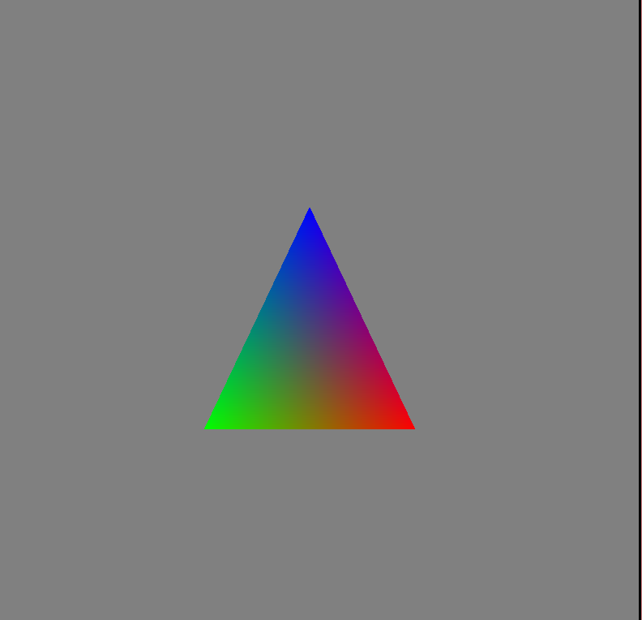
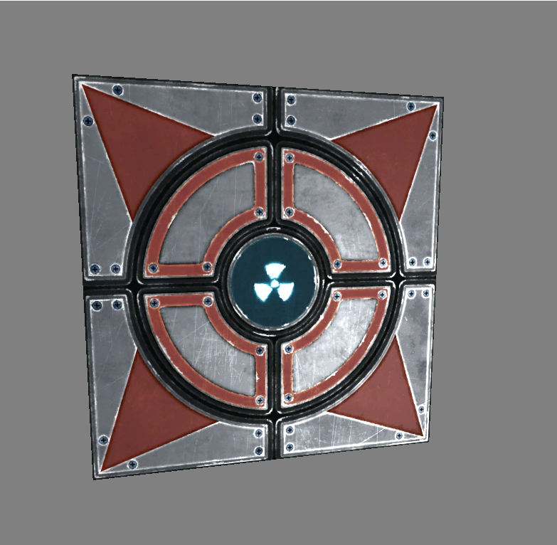
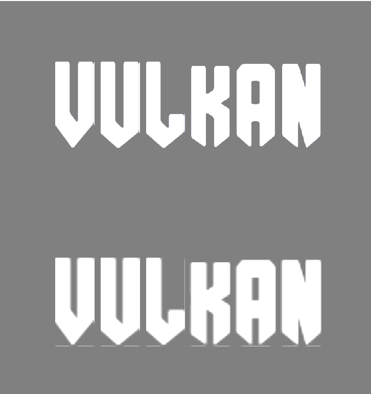
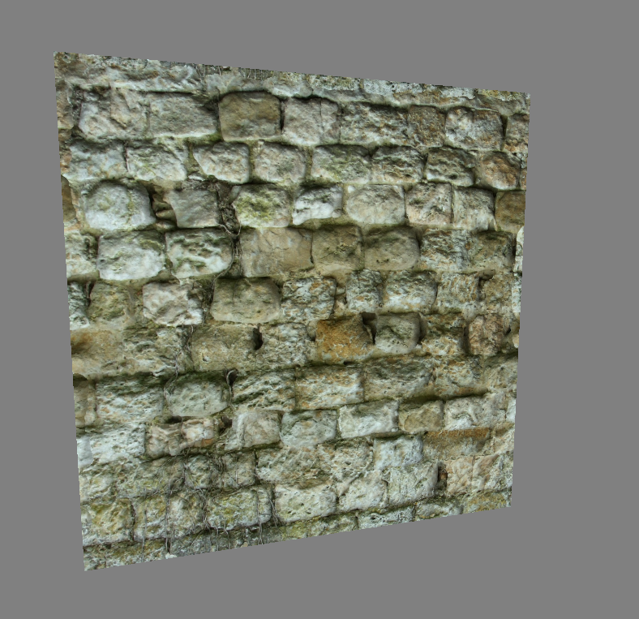
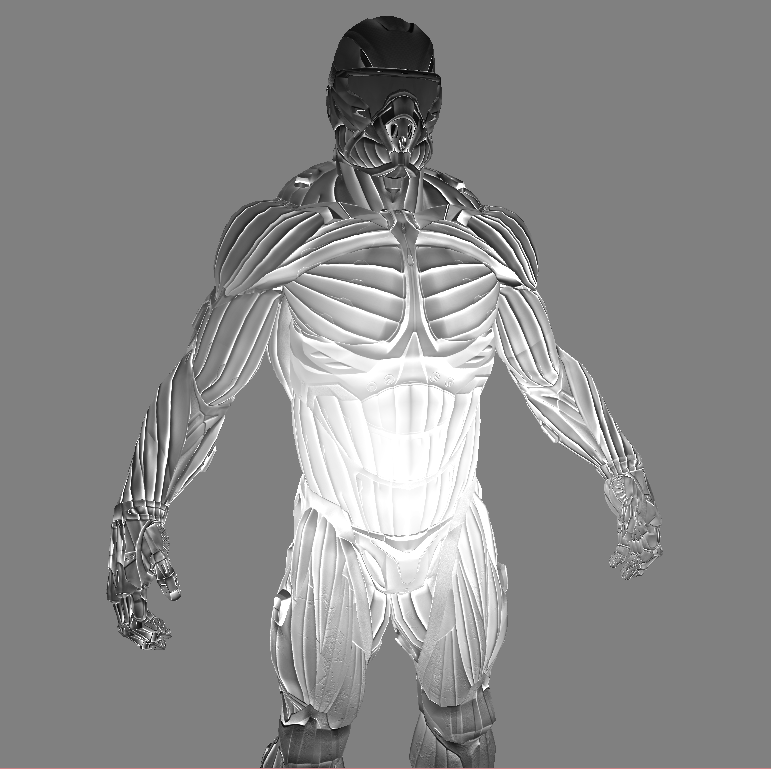
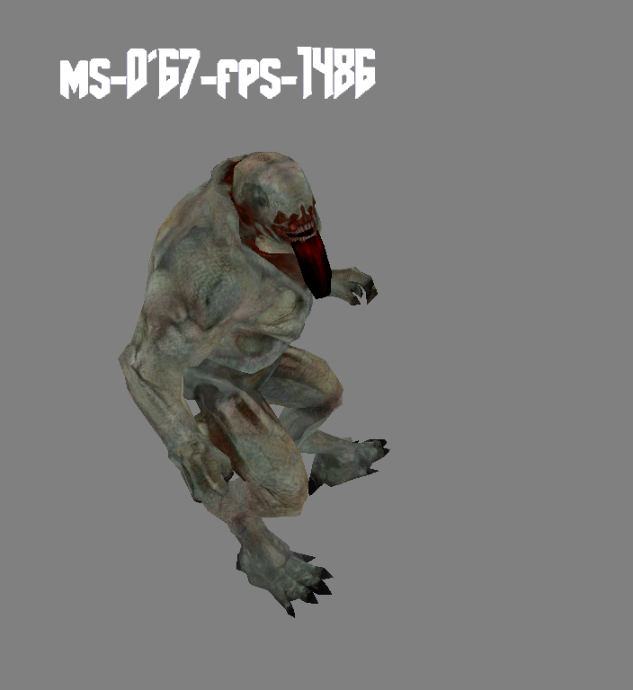
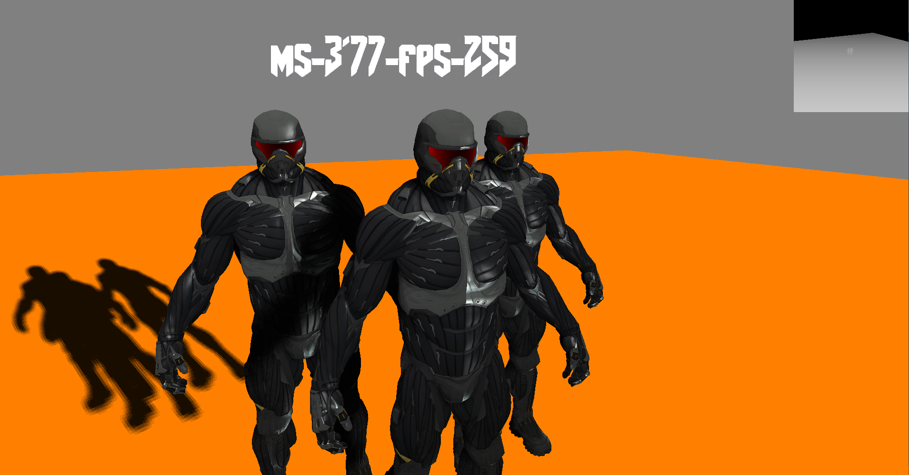
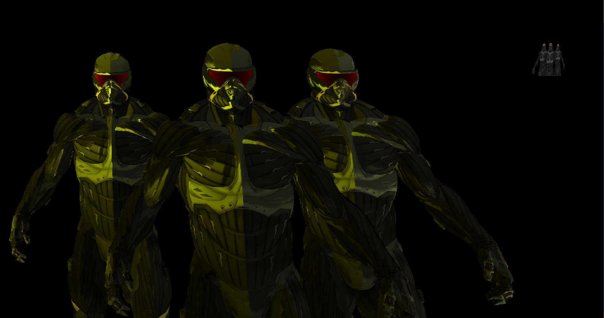
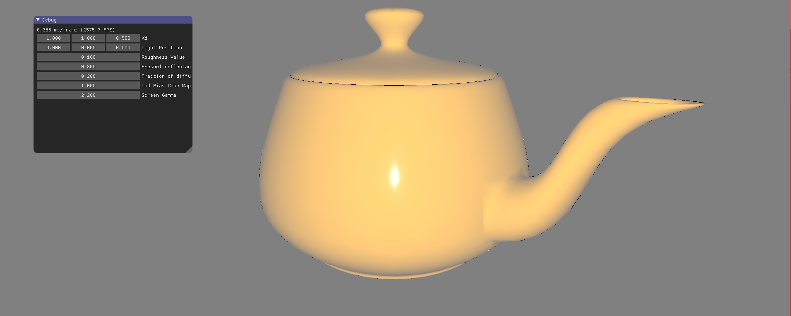
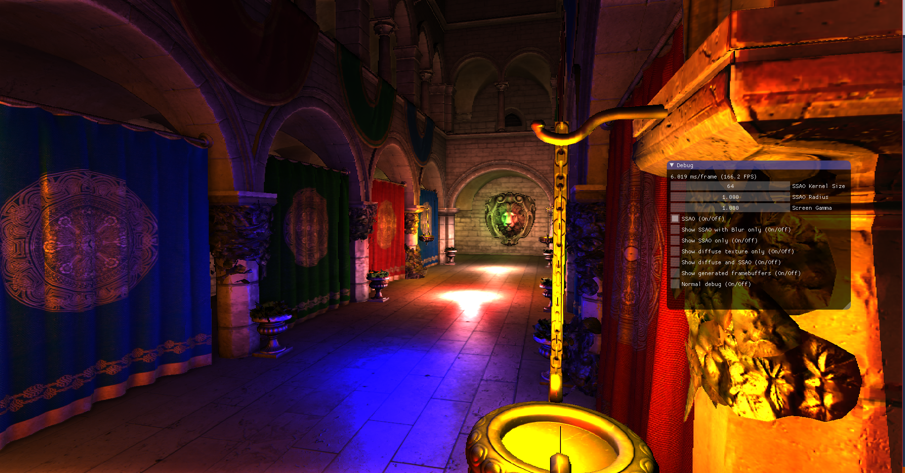

# TywRenderer

Vulkan Renderer. Work in progress. All testing was done on (r9 255 - Driver version 16.8.2)
- Warning. Take the code with grain of salt as it might violate Vulkan specs.
- Big Warning. Some of resources are not freed correctly. Work in progress...
- Always happy to hear what could be fixed or improved.
- Still have validation errors on some projects. Work in progress....

#How to Build
Currently works only under windows.
Run .bat file which will build vs2015 solution

In order to get working. You need to have working Vulkan driver and Vulkan SDK that you can download from LunarG site
- LunarG Vulkan SDK - https://lunarg.com/
- More information about glsllang - https://github.com/KhronosGroup/glslang
- More information about validation layer - https://github.com/KhronosGroup/Vulkan-LoaderAndValidationLayers
- More information about Vulkan - https://github.com/KhronosGroup/Vulkan-Docs

#Dll and Lib dependencies
- Assimp
- LibPng
- Freetype 

#Please check ThirdParty Licenses
- Freetype -  https://www.freetype.org/
- ImGui    -  https://github.com/ocornut/imgui
- Assimp   -  https://github.com/assimp/assimp
- LibPng   -  http://www.libpng.org/pub/png/libpng.htm
- GLI      -  http://gli.g-truc.net/0.8.1/index.html
- Cotire   -  https://github.com/sakra/cotire

#Credits
- Sascha Willems - https://github.com/SaschaWillems/Vulkan

#Projects
## [Triangle](Projects/Triangle)

Shader - [Triangle Shader](Assets/Shaders/Triangle)

## [Texture](Projects/Texture)

Shader - [Texture Shader](Assets/Shaders/Texture)

## [Freetype font rendering](Projects/FontRendering)

The fonts texture were generated using Freetype2 library. The texture format that is generated by freetype is VK_FORMAT_R8_UNORM
For each glyph a texture is generated and put it into descriptors list. Of course it very bad thing to do.
The best thing is to have one texture for all glyps and point to specific char UV coordinates. In order to have alpha enabled you need
to enable blending in your VkPipeline.
First one is using signed distance field, the second one(down) does not use signed distance field.
There are still some strange edge bleeding which I do not know really why.
> - [Signed distance field shader](Assets/Shaders/FontRendering/FontRendering.frag)
> - [Non Signed distance field shader](Assets/Shaders/FontRendering/NonSdf.frag)

## [Normal Mapping](Projects/NormalMapping)

Shader - [Normal Mapping Shader](Assets/Shaders/NormalMapping)

## [Static Model](Projects/StaticModel)

Shader - [Static Model Shader](Assets/Shaders/StaticModel)
There are issues with normal mapping. Shader is not complete.
Using TBN Matrix convert view vector and light vector to tangent space. Doing this results in black model.
Using my own wavefront parser.

## [Skeletal Animation](Projects/SkeletalAnimation)

Shader (should be renamed to gpu instead of cpu... cuz gpu skinning it is) - [Static Model Shader](Assets/Shaders/SkeletalAnimation)
GPU skinning of MD5 file. MD5 file usually have less then 9 bones per vertex (usually max is 4 in game industry), so had to setup second vec4 for boneWeight and jointId. Also, glm does not handle well small angles so had to use different version of slerp which would handle small angles. Some info about getting MD5 rendering part is here -> https://github.com/gszauer/3DAnimation/blob/master/MD5/README.md

## [Shadow Mapping](Projects/ShadowMapping)

[Shadow Maping Shader](Assets/Shaders/ShadowMapping). Shadow mapping with higher depth buffer range. More about shadow maps can be found on here:
- http://outerra.blogspot.co.uk/2012/11/maximizing-depth-buffer-range-and.html
- http://learnopengl.com/#!Advanced-Lighting/Shadows/Shadow-Mapping
- http://www.opengl-tutorial.org/intermediate-tutorials/tutorial-16-shadow-mapping/

## [Deferred Rendering](Projects/DeferredShading)

[Deferred Rendering Shader](Assets/Shaders/DeferredShading)
It uses only two textures. Both textures are compressed and their format is VK_FORMAT_R32G32B32A32_UINT. First texture has compressed position and specular texture, both of them are vec3 type. We waste one A32 component. For some reason got it working only with 4 components (will need to try fixing it). Second texture has packed Normal, Diffuse and Depth textures. If you would look at better compression algorithms, you could definetily find a way to pack Position, Diffuse and Specular in single R32G32B32 but of course you would lose precision. The solution I'm using this time gave the best results without any loss in quality. The only problem is that the output looks litlle bit squashed.
Some usefull links on this thing:
> http://aras-p.info/blog/2009/07/30/encoding-floats-to-rgba-the-final/
> http://stackoverflow.com/questions/6893302/decode-rgb-value-to-single-float-without-bit-shift-in-glsl

## [Physical Based Shading - Work in progress](Projects/DeferredShading)

[Physical Based Shader](Assets/Shaders/PhysicalBasedShading)
Big part of the code is based on the Frostbite documentation on PBR.
//http://www.frostbite.com/wp-content/uploads/2014/11/course_notes_moving_frostbite_to_pbr_v2.pdf

## [SSAO - Work in progress](Projects/SSAO)

[SSAO shader](Assets/Shaders/SSAO)
Based on John Champan tutorial for Normal oriented SSAO.
http://john-chapman-graphics.blogspot.co.uk/2013/01/ssao-tutorial.html

## License
Copyright (c) 2016 Tomas Mikalauskas

Permission is hereby granted, free of charge, to any person obtaining a copy of this software and associated documentation files (the "Software"), to deal in the Software without restriction, including without limitation the rights to use, copy, modify, merge, publish, distribute, sublicense, and/or sell copies of the Software, and to permit persons to whom the Software is furnished to do so, subject to the following conditions:

The above copyright notice and this permission notice shall be included in all copies or substantial portions of the Software.

THE SOFTWARE IS PROVIDED "AS IS", WITHOUT WARRANTY OF ANY KIND, EXPRESS OR IMPLIED, INCLUDING BUT NOT LIMITED TO THE WARRANTIES OF MERCHANTABILITY, FITNESS FOR A PARTICULAR PURPOSE AND NONINFRINGEMENT. IN NO EVENT SHALL THE AUTHORS OR COPYRIGHT HOLDERS BE LIABLE FOR ANY CLAIM, DAMAGES OR OTHER LIABILITY, WHETHER IN AN ACTION OF CONTRACT, TORT OR OTHERWISE, ARISING FROM, OUT OF OR IN CONNECTION WITH THE SOFTWARE OR THE USE OR OTHER DEALINGS IN THE SOFTWARE.

Some of the assets have different license. Please comply to these when redistributing or using them in your own projects :
- [boblamp](Assets//Geometry/boblamp) - http://www.katsbits.com/download/models/
- [cyberwarrior](Assets/Geometry/cyberwarrior) - https://sketchfab.com/models/86f58bf5151c410facacf0ed6a2ebd53
- [hellknight](Assets/Geometry/hellknight) Ripped and modified from Doom 3 - http://store.steampowered.com/app/9050/
- [nanosuit](Assets/Geometry/nanosuit) - Modiffied version from  http://tf3dm.com/3d-model/crysis-2-nanosuit-2-97837.html
- [photosculpt](Assets/Textures/photosculpt) - http://photosculpt.net/free-textures/
- [doom freetype](Assets/Textures/freetype/AmazDooMLeft.ttf) http://www.dafont.com/amazdoom.font
- [sponza geometry](Assets/Geometry/Sponza) and [sponza textures](Assets/Textures/sponza)
